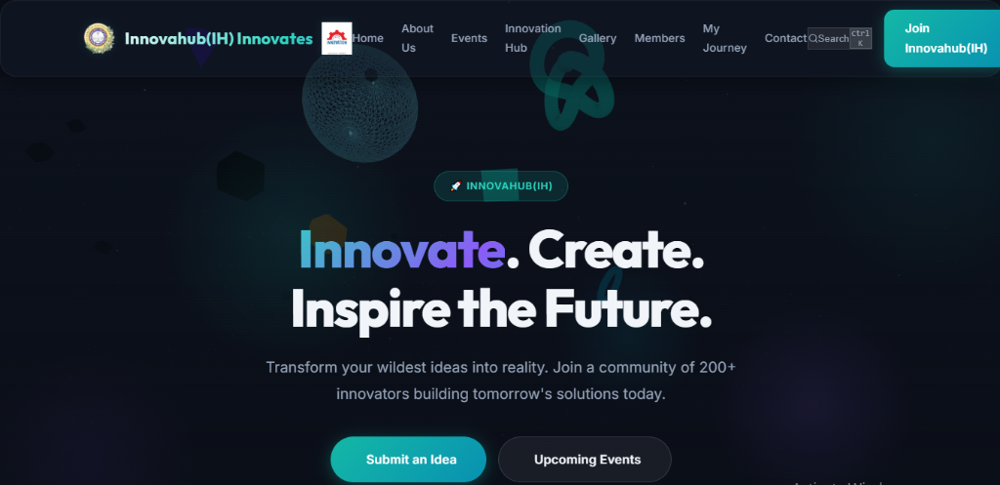
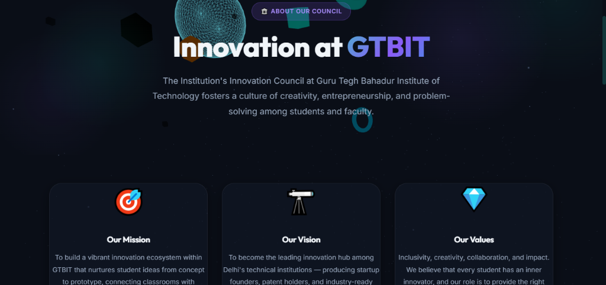
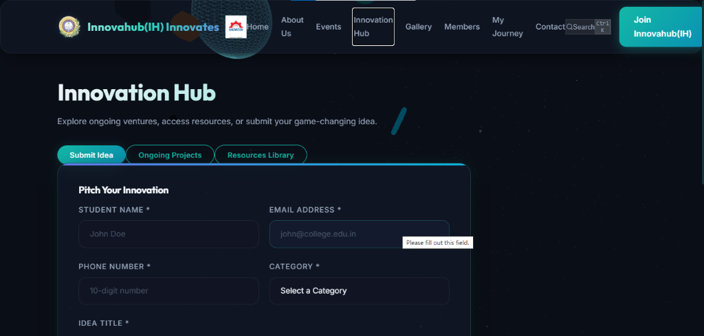
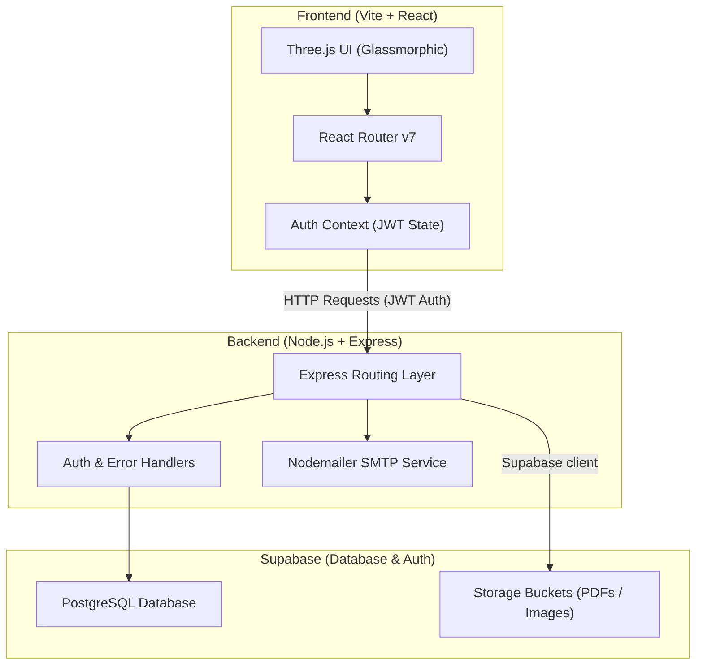

# <align align="center">⚡ SocietyConnect ⚡</align>
### <align align="center">**Innovahub(IH) — Modern Community Management Platform**</align>

<p align="center">
  
  
  
  
  
  
  
</p>

---

## 🔮 Overview

**SocietyConnect** is a sample web portal built for college cells, specifically inspired by **Innovahub(IH)**. The platform provides a sleek, modern, and interactive interface for college students to register for innovation events, submit project pitches, view community members, and download reports. For administrators, it offers a secure command suite to broadcast emails, moderate ideas, oversee event capacity, and manage user interactions.

Designed with **glassmorphism**, a futuristic **Three.js particle background**, and smooth micro-animations, SocietyConnect delivers a premium, highly engaging user experience.

---

## 📸 Showcase & UI Gallery

### 🏠 Landing Page
A futuristic dark-mode hero section with a reactive Three.js particle field, a glassmorphic navigation header, and glowing buttons.
<p align="center">
  
</p>

### 🏫 About Council (Innovation at GTBIT)
A grid-based view highlighting the Mission, Vision, and Values of the Institution's Innovation Council at Guru Tegh Bahadur Institute of Technology.
<p align="center">
  
</p>

### 💡 Innovation Hub Pitching Portal
An intuitive form enabling students to submit startups and project ideas directly to the administration.
<p align="center">
  
</p>

---

## 🌌 Core Features

### 👨‍🎓 Student & Innovator Hub
*   🚀 **Innovation Portal:** Pitch start-up/project ideas directly to the council and track approval status with a unique auto-generated tracking ID.
*   📅 **Event Management:** Browse upcoming events, verify capacity limits, and complete registrations instantly.
*   📋 **Knowledge Database:** Search and download official annual reports, faculty/member rosters, and dynamic image galleries.
*   💬 **Query Desk:** Contact form for queries and feedback with support for file attachments and email notification tickets.

### 🛡️ Admin Command Suite
*   📈 **Analytical Dashboard:** Gain immediate insights on member registrations, upcoming events, and submitted startup pitches.
*   🎨 **Content Moderation:** Publish events, upload gallery photos, update community member files, and submit official report PDFs.
*   💡 **Idea Evaluation:** Review incoming startup and research ideas, comment with feedback, and change submission status.
*   📧 **Nodemailer Email Hub:** Send broadcast messages, alerts, and registration confirmations directly to members from the portal.
*   🔧 **Dynamic Configurations:** Tweak main landing settings (college name, contacts, social media handles) instantly via a dedicated database-backed configuration panel.

---

## 🎨 Design System & UX

The application is styled with a custom dark-mode theme utilizing vanilla CSS with modern styling practices:
*   **Aesthetics:** Semitransparent glass panels (`backdrop-filter: blur()`), vibrant gradient texts, and glowing boundaries.
*   **Visual Enhancements:** Dynamic floating background orbs and interactive Three.js 3D particles responsive to viewport resizing.
*   **Micro-interactions:** Ease-out cubic animation counters on the homepage showcasing platform engagement statistics.
*   **Global Access:** Shift-key / button-activated Search overlay for rapid navigation.
*   **Performance optimization:** Built-in backend ping service keeping free hosting tiers (like Render) awake by pinging `/ping` every 4 minutes.

---

## 🏗️ Architecture Flow



---

## 🛠️ Tech Stack

| Layer | Technology | Key Use Case |
| :--- | :--- | :--- |
| **Frontend** | **React 19** | Dynamic, component-driven user interface |
| **Routing** | **React Router Dom v7** | Fluid, single-page application navigation |
| **Graphics** | **Three.js** | Interactive 3D particle background |
| **Icons** | **Lucide React** | Consistent, modern vector iconography |
| **Server** | **Node.js + Express 5** | RESTful API server handling core operations |
| **Database** | **Supabase (PostgreSQL)** | Persistent storage, relation tables, default seed data |
| **Auth** | **JWT & Bcrypt** | Secure password hashing & stateless session management |
| **Mailing** | **Nodemailer** | System notification pings and announcements |
| **Hosting** | **Render & Vercel** | Multi-service cloud deployments |

---

## ⚙️ Environment Configuration

### Backend Setup (`backend/.env`)
Create a `.env` file in the `backend/` directory based on the variables below:

| Variable | Description | Example / Default Value |
| :--- | :--- | :--- |
| `PORT` | Listening port for Express server | `5000` |
| `NODE_ENV` | Running environment | `development` |
| `SUPABASE_URL` | Endpoint URL from Supabase dashboard | `https://your-project.supabase.co` |
| `SUPABASE_KEY` | Anonymous/Service key from API keys | `your-supabase-anon-key` |
| `JWT_SECRET` | Secret token for signing JWT sessions | `generate-a-strong-random-string` |
| `FRONTEND_URL` | Allowed origin for CORS handshakes | `http://localhost:5173` |
| `SMTP_HOST` | *(Optional)* SMTP host for mailing | `smtp.gmail.com` |
| `SMTP_PORT` | *(Optional)* Port used by SMTP server | `465` |
| `SMTP_USER` | *(Optional)* Authenticated email user | `your-email@gmail.com` |
| `SMTP_PASS` | *(Optional)* Email App Password | `your-app-password` |

### Frontend Setup (`frontend/.env`)
Create a `.env` file in the `frontend/` directory:

```env
VITE_API_URL=http://localhost:5000
```

---

## 🚀 Quick Start Guide

### 1. Prerequisite Installations
Ensure you have [Node.js (v18+)](https://nodejs.org) and [npm](https://npmjs.com) configured.

### 2. Clone and Install Dependencies
```bash
# Clone the repository
git clone https://github.com/Chandradeep05/SocietyConnect--Modern_Community_Management_Platform-.git
cd SocietyConnect--Modern_Community_Management_Platform-

# Install Backend Dependencies
cd backend
npm install

# Install Frontend Dependencies
cd ../frontend
npm install
```

### 3. Database Setup (Supabase)
1. Register/Login on [Supabase](https://supabase.com/).
2. Create a new project.
3. Open the **SQL Editor** in the Supabase workspace.
4. Copy the complete SQL commands from [supabase_schema.sql](./backend/supabase_schema.sql) and execute them. This builds all tables, relationships, and default admin credentials.
5. Copy your **API URL** and **Anon Key** from the Supabase API settings into your backend `.env` file.

### 4. Running the Application Locally
Open two terminal windows to run both services simultaneously:

**Terminal 1: Backend Server**
```bash
cd backend
npm start
```
*Server will launch on `http://localhost:5000`.*

**Terminal 2: Frontend Client**
```bash
cd frontend
npm run dev
```
*Client will launch on `http://localhost:5173`.*

---

## 🔐 Local Seeding & Security Advisory

> [!WARNING]
> **Production Security Warning:** The database setup script (`supabase_schema.sql`) seeds a default administrator account for **local development and testing only**.
> * **Local Testing Email:** `admin@innovahub.com`
> * **Local Testing Password:** `admin123`
>
> You **MUST** change these default credentials or remove the seeded record from the `admins` table before deploying the application to a production environment. To modify the default administrator, update the insert statement at the bottom of [supabase_schema.sql](./backend/supabase_schema.sql) or execute an `UPDATE` SQL query in your Supabase SQL Editor.

---

## 📦 Deployment

### Backend (Render Setup)
The project includes a [render.yaml](./render.yaml) configuration to automate deployment.
1. Connect your GitHub repository to Render.
2. Choose **Blueprint** and import from the repository.
3. Fill in the required Environment Variables (`SUPABASE_URL`, `SUPABASE_KEY`, `FRONTEND_URL`) inside the Render dashboard.

### Frontend (Vercel Setup)
The frontend contains [vercel.json](./frontend/vercel.json) to handle React SPA routing.
1. Import the repository's `frontend` folder into Vercel.
2. In Build & Development Settings, verify the root directory is set to `frontend`.
3. Set the environment variable: `VITE_API_URL` pointing to your deployed Render URL.
4. Deploy the application.

---

## 📄 License
This project is licensed under the **ISC License**. Refer to the [package.json](./backend/package.json) file for details.
